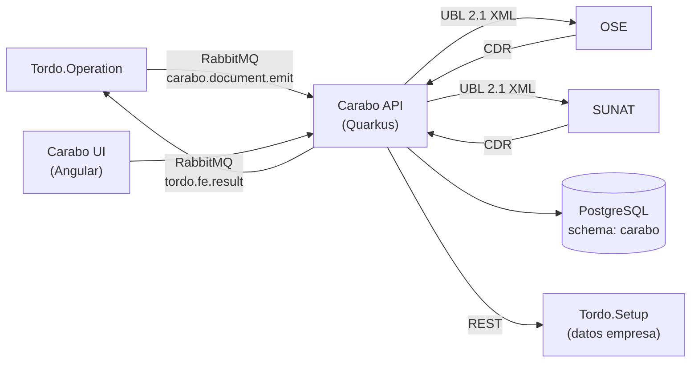
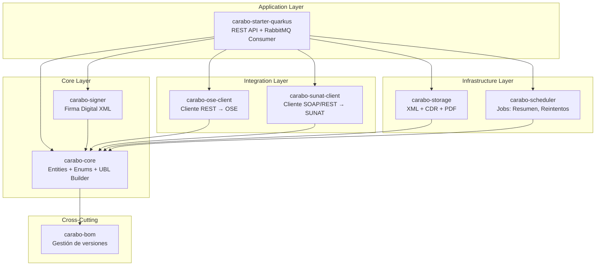
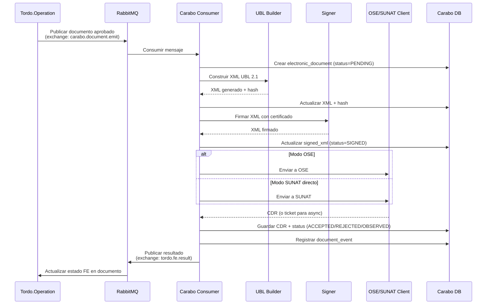
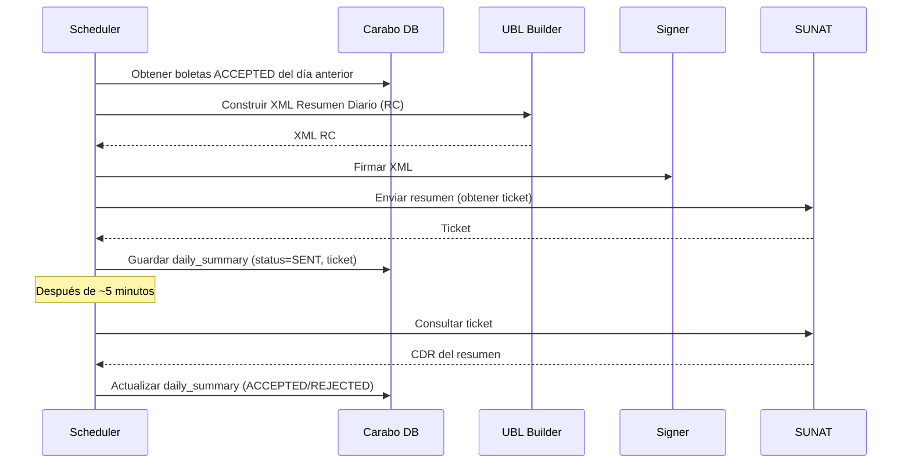
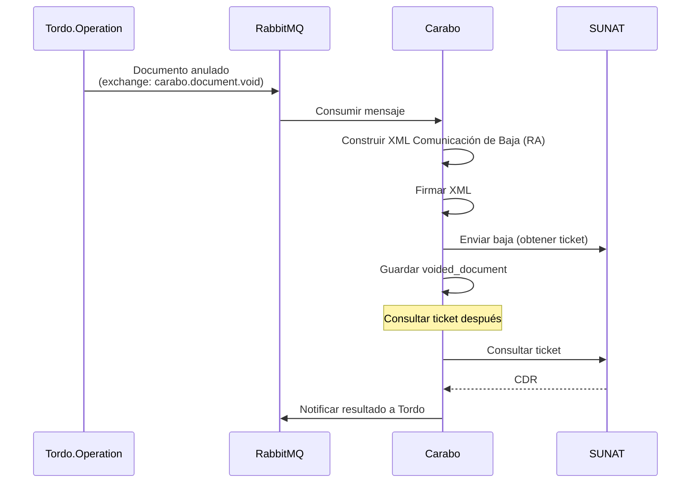
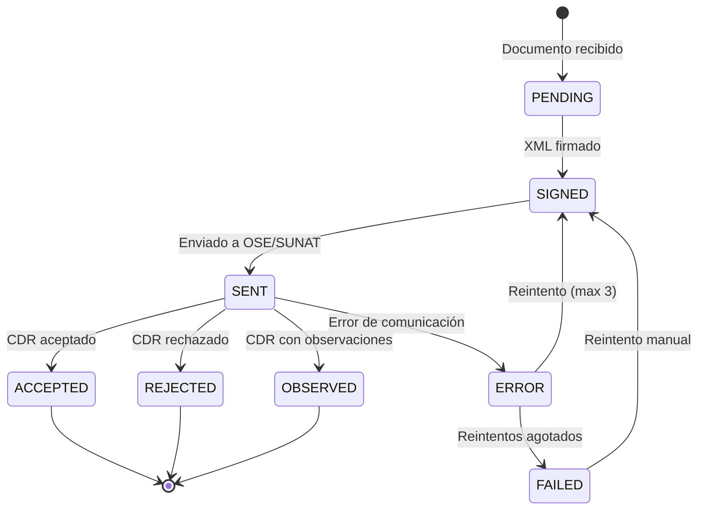
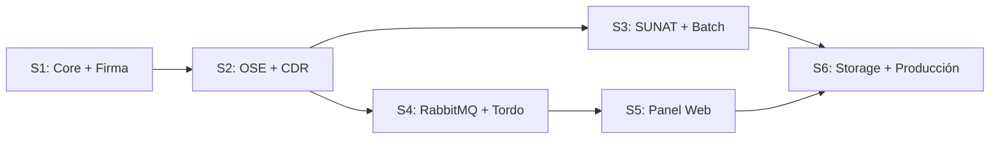

# Plan de Implementación — Carabo 🦉

> Ave fiscalizadora — Servicio de facturación electrónica SUNAT multiempresa.
> Última actualización: 2025-06

---

## 1. Contexto

### Qué es Carabo

Carabo es un servicio **independiente** de facturación electrónica que:
- Recibe documentos aprobados desde Tordo vía RabbitMQ
- Genera XML UBL 2.1 según estándar SUNAT
- Firma digitalmente con certificado de la empresa
- Envía a OSE o SUNAT directa según configuración
- Recibe CDR y notifica resultado a Tordo
- Provee un panel web para configurar empresas, certificados y conexiones

### Qué NO es Carabo

- **No duplica datos de empresa** — consulta a Tordo/setup vía API para RUC, razón social, dirección fiscal
- **No genera documentos** — solo los recibe ya aprobados y los convierte a XML electrónico
- **No maneja lógica de negocio** — no sabe de inventario, pagos ni caja

### Relación con el ecosistema

---

## 2. Arquitectura de Módulos

---

## 3. Modelo de Datos (schema `carabo`)

### 3.1 Tablas

Carabo **NO** tiene tabla `company`. Los datos de empresa (RUC, razón social, dirección) se consultan a Tordo/setup. Carabo solo almacena la **configuración de facturación electrónica** por empresa.

| Tabla | Descripción |
|-------|-------------|
| `fe_config` | Configuración de FE por empresa: modo (OSE/SUNAT), estado activo |
| `fe_certificate` | Certificado digital .pfx/.p12 por empresa, contraseña cifrada, vigencia |
| `ose_connection` | Conexión al OSE: proveedor, URL, token/API key |
| `sunat_connection` | Conexión directa SUNAT: usuario SOL, clave SOL, URLs servicios |
| `electronic_document` | Documento electrónico emitido: tipo, serie, correlativo, XML, hash, CDR, estado |
| `document_event` | Historial de eventos: enviado, aceptado, rechazado, reintento, error |
| `daily_summary` | Resumen diario de boletas: fecha, ticket SUNAT, estado |
| `voided_document` | Comunicación de baja: documentos anulados, ticket SUNAT |

### 3.2 Entidad principal: `electronic_document`

| Campo | Tipo | Descripción |
|-------|------|-------------|
| `id` | uuid PK | |
| `business_code` | varchar(20) | Código de empresa en Tordo (no RUC — se consulta a setup) |
| `document_type` | enum | INVOICE, RECEIPT, CREDIT_NOTE, DEBIT_NOTE, DISPATCH_GUIDE |
| `series` | varchar(10) | Serie del documento (F001, B001, etc.) |
| `correlative` | int | Correlativo |
| `issue_date` | timestamp | Fecha de emisión |
| `customer_doc` | varchar(20) | RUC/DNI del cliente |
| `customer_name` | varchar(300) | Nombre/razón social |
| `total_amount` | decimal(18,2) | Monto total |
| `currency` | varchar(3) | PEN, USD |
| `status` | enum | PENDING, SIGNED, SENT, ACCEPTED, REJECTED, OBSERVED, ERROR |
| `xml_content` | text | XML UBL 2.1 generado |
| `xml_hash` | varchar(100) | Hash del XML |
| `signed_xml` | text | XML firmado |
| `cdr_content` | text | CDR recibido |
| `cdr_status_code` | varchar(10) | Código de respuesta SUNAT |
| `cdr_message` | varchar(500) | Mensaje de respuesta |
| `sunat_ticket` | varchar(50) | Ticket para consulta asíncrona |
| `source_doc_id` | varchar(50) | ID del documento en Tordo |
| `source_system` | varchar(30) | TORDO (origen) |
| `retry_count` | int | Intentos de envío |
| `last_error` | varchar(500) | Último error |

### 3.3 Entidad: `fe_config`

| Campo | Tipo | Descripción |
|-------|------|-------------|
| `id` | uuid PK | |
| `business_code` | varchar(20) UK | Código de empresa en Tordo |
| `send_mode` | enum | OSE, SUNAT_DIRECT |
| `is_active` | boolean | Empresa habilitada para FE |
| `beta_mode` | boolean | Usar entorno beta de SUNAT |

### 3.4 Entidad: `fe_certificate`

| Campo | Tipo | Descripción |
|-------|------|-------------|
| `id` | uuid PK | |
| `business_code` | varchar(20) FK | |
| `certificate_data` | bytea | Contenido del .pfx/.p12 |
| `certificate_password` | varchar(200) | Contraseña cifrada (AES) |
| `valid_from` | date | Inicio de vigencia |
| `valid_to` | date | Fin de vigencia |
| `is_active` | boolean | |

---

## 4. Flujos

### 4.1 Emisión de documento (flujo principal)

### 4.2 Resumen diario de boletas

### 4.3 Comunicación de baja

### 4.4 Reintentos automáticos

---

## 5. API Endpoints

### 5.1 Configuración (panel web)

| Método | Endpoint | Descripción |
|--------|----------|-------------|
| `GET` | `/config/{businessCode}` | Obtener configuración FE de empresa |
| `PUT` | `/config/{businessCode}` | Actualizar modo (OSE/SUNAT), activar/desactivar |
| `POST` | `/config/{businessCode}/certificate` | Subir certificado digital |
| `GET` | `/config/{businessCode}/certificate` | Ver estado del certificado |
| `PUT` | `/config/{businessCode}/ose` | Configurar conexión OSE |
| `PUT` | `/config/{businessCode}/sunat` | Configurar conexión SUNAT directa |
| `POST` | `/config/{businessCode}/test` | Probar conexión (enviar factura de prueba) |

### 5.2 Documentos

| Método | Endpoint | Descripción |
|--------|----------|-------------|
| `POST` | `/document/emit` | Emitir documento (alternativa REST a RabbitMQ) |
| `GET` | `/document/{id}` | Detalle de documento + eventos |
| `GET` | `/document` | Listar documentos (filtros: empresa, tipo, estado, fecha) |
| `POST` | `/document/{id}/retry` | Reintentar envío manual |
| `GET` | `/document/{id}/xml` | Descargar XML firmado |
| `GET` | `/document/{id}/cdr` | Descargar CDR |

### 5.3 Operaciones batch

| Método | Endpoint | Descripción |
|--------|----------|-------------|
| `POST` | `/batch/daily-summary` | Forzar generación de resumen diario |
| `POST` | `/batch/void` | Enviar comunicación de baja |
| `GET` | `/batch/daily-summary` | Listar resúmenes diarios |
| `GET` | `/batch/void` | Listar comunicaciones de baja |

### 5.4 Dashboard

| Método | Endpoint | Descripción |
|--------|----------|-------------|
| `GET` | `/dashboard/summary` | Totales: emitidos, aceptados, rechazados, pendientes |
| `GET` | `/dashboard/by-type` | Desglose por tipo de documento |
| `GET` | `/dashboard/by-date` | Serie temporal de emisiones |

---

## 6. Módulos — Detalle técnico

### 6.1 `carabo-core`

Dominio puro sin dependencias de framework.

| Componente | Descripción |
|-----------|-------------|
| `DocumentType` enum | INVOICE(01), RECEIPT(03), CREDIT_NOTE(07), DEBIT_NOTE(08), DISPATCH_GUIDE(09), VOIDED(RA), DAILY_SUMMARY(RC) |
| `DocumentStatus` enum | PENDING, SIGNED, SENT, ACCEPTED, REJECTED, OBSERVED, ERROR, FAILED |
| `SendMode` enum | OSE, SUNAT_DIRECT |
| `ElectronicDocument` entity | Documento electrónico principal |
| `DocumentEvent` entity | Historial de eventos |
| `FeConfig` entity | Configuración FE por empresa |
| `FeCertificate` entity | Certificado digital por empresa |
| `OseConnection` entity | Conexión OSE |
| `SunatConnection` entity | Conexión SUNAT directa |
| `DailySummary` entity | Resumen diario |
| `VoidedDocument` entity | Comunicación de baja |
| `InvoiceUblBuilder` | Construye XML UBL 2.1 para factura |
| `ReceiptUblBuilder` | Construye XML UBL 2.1 para boleta |
| `CreditNoteUblBuilder` | Construye XML UBL 2.1 para NC |
| `DispatchGuideUblBuilder` | Construye XML para guía de remisión |
| `DailySummaryXmlBuilder` | Construye XML de resumen diario |
| `VoidedXmlBuilder` | Construye XML de comunicación de baja |

### 6.2 `carabo-signer`

| Componente | Descripción |
|-----------|-------------|
| `XmlSigner` | Firma XML con certificado .pfx/.p12 (XMLDSig) |
| `CertificateLoader` | Carga certificado desde bytes + password |
| `HashGenerator` | Genera digest SHA-256 del XML |

### 6.3 `carabo-ose-client`

| Componente | Descripción |
|-----------|-------------|
| `OseClient` interface | Contrato genérico para cualquier OSE |
| `NubefactClient` | Implementación para Nubefact |
| `BizlinksClient` | Implementación para Bizlinks |
| `OseResponse` | Respuesta normalizada del OSE (CDR, código, mensaje) |

### 6.4 `carabo-sunat-client`

| Componente | Descripción |
|-----------|-------------|
| `SunatSoapClient` | Cliente SOAP para envío de facturas/NC (BillService) |
| `SunatRestClient` | Cliente REST para guías de remisión (API REST SUNAT) |
| `SunatTicketClient` | Consulta de tickets asíncronos |
| `SunatResponse` | Respuesta normalizada |

### 6.5 `carabo-storage`

| Componente | Descripción |
|-----------|-------------|
| `DocumentStorage` | Almacena XML, CDR, PDF en filesystem o S3 |
| `PdfGenerator` | Genera representación impresa (PDF) del documento |

### 6.6 `carabo-scheduler`

| Componente | Descripción |
|-----------|-------------|
| `DailySummaryJob` | Genera y envía resumen diario de boletas (cron: 6am) |
| `RetryJob` | Reintenta documentos en ERROR (cron: cada 15min) |
| `TicketCheckJob` | Consulta tickets pendientes de SUNAT (cron: cada 5min) |
| `CertificateExpiryJob` | Alerta de certificados próximos a vencer (cron: diario) |

### 6.7 `carabo-starter-quarkus`

| Componente | Descripción |
|-----------|-------------|
| `DocumentResource` | REST endpoints para documentos |
| `ConfigResource` | REST endpoints para configuración |
| `DashboardResource` | REST endpoints para dashboard |
| `BatchResource` | REST endpoints para operaciones batch |
| `DocumentConsumer` | RabbitMQ consumer para `carabo.document.emit` |
| `VoidConsumer` | RabbitMQ consumer para `carabo.document.void` |
| `EmissionService` | Orquesta: build XML → sign → send → save CDR → notify |
| `ConfigService` | CRUD de configuración FE por empresa |

---

## 7. Panel Web (Carabo UI — Angular)

### 7.1 Pantallas

| Pantalla | Ruta | Descripción |
|----------|------|-------------|
| Dashboard | `/` | Métricas: emitidos, aceptados, rechazados, pendientes por empresa |
| Empresas | `/config` | Lista de empresas configuradas, estado de FE |
| Config empresa | `/config/:businessCode` | Modo OSE/SUNAT, certificado, conexiones |
| Certificado | `/config/:businessCode/certificate` | Subir .pfx/.p12, ver vigencia |
| Documentos | `/documents` | Lista de documentos emitidos con filtros |
| Detalle documento | `/documents/:id` | XML, CDR, eventos, reintento |
| Resúmenes | `/batch/summaries` | Resúmenes diarios de boletas |
| Bajas | `/batch/voided` | Comunicaciones de baja |

### 7.2 Stack

- Angular 19 (standalone components)
- Angular Material
- Proxy a Carabo API vía Kong (`/carabo/api/*`)

---

## 8. Fases de Implementación

### Fase S1 — Core + Firma + Emisión básica
> **Objetivo:** Emitir una factura electrónica firmada y enviarla a un OSE mock.
> **Duración estimada:** 3-4 semanas

| ID | Historia | Prioridad | Estimación |
|----|---------|-----------|------------|
| S1-01 | Entities: ElectronicDocument, DocumentEvent, FeConfig, FeCertificate | P0 | M |
| S1-02 | InvoiceUblBuilder — generar XML UBL 2.1 para factura (01) | P0 | XL |
| S1-03 | XmlSigner — firma digital con certificado .pfx/.p12 | P0 | L |
| S1-04 | HashGenerator — digest SHA-256 | P0 | S |
| S1-05 | EmissionService — orquesta build → sign → save | P0 | L |
| S1-06 | DocumentResource — POST /document/emit, GET /:id | P0 | M |
| S1-07 | ConfigResource — CRUD de FeConfig + FeCertificate | P0 | M |
| S1-08 | Tests unitarios: UBL builder, signer, emission flow | P0 | L |
| S1-09 | Test k6 en Buteo: emitir factura vía REST | P1 | M |

**Entregable:** Factura XML UBL 2.1 firmada, almacenada en DB, lista para enviar.

### Fase S2 — Conexión OSE + CDR
> **Objetivo:** Enviar factura a un OSE real y procesar CDR.
> **Duración estimada:** 2-3 semanas

| ID | Historia | Prioridad | Estimación |
|----|---------|-----------|------------|
| S2-01 | OseClient interface + NubefactClient implementación | P0 | L |
| S2-02 | Entity OseConnection + ConfigResource endpoints | P0 | M |
| S2-03 | Procesar CDR: parsear respuesta, extraer código/mensaje | P0 | L |
| S2-04 | DocumentEvent: registrar cada intento de envío | P0 | M |
| S2-05 | RetryJob: reintentar documentos en ERROR (max 3) | P1 | M |
| S2-06 | ReceiptUblBuilder — boleta (03) | P0 | L |
| S2-07 | CreditNoteUblBuilder — nota de crédito (07) | P0 | L |
| S2-08 | Tests: envío mock OSE, parseo CDR, reintentos | P0 | L |

**Entregable:** Factura + boleta + NC enviadas a OSE, CDR procesado, reintentos automáticos.

### Fase S3 — SUNAT directo + Batch
> **Objetivo:** Soporte SUNAT directo + resumen diario + comunicación de baja.
> **Duración estimada:** 2-3 semanas

| ID | Historia | Prioridad | Estimación |
|----|---------|-----------|------------|
| S3-01 | SunatSoapClient — envío vía BillService SOAP | P0 | L |
| S3-02 | Entity SunatConnection + ConfigResource endpoints | P0 | M |
| S3-03 | DailySummaryXmlBuilder + DailySummaryJob | P1 | L |
| S3-04 | VoidedXmlBuilder + comunicación de baja | P1 | L |
| S3-05 | SunatTicketClient — consulta de tickets async | P1 | M |
| S3-06 | TicketCheckJob — cron cada 5min | P1 | M |
| S3-07 | DispatchGuideUblBuilder — guía de remisión (09) vía REST SUNAT | P1 | L |
| S3-08 | Tests: SUNAT mock, resumen diario, baja | P0 | L |

**Entregable:** Soporte dual OSE/SUNAT, resumen diario, comunicación de baja, guía electrónica.

### Fase S4 — RabbitMQ + Integración Tordo
> **Objetivo:** Integración bidireccional Tordo ↔ Carabo vía RabbitMQ.
> **Duración estimada:** 2 semanas

| ID | Historia | Prioridad | Estimación |
|----|---------|-----------|------------|
| S4-01 | DocumentConsumer — consume `carabo.document.emit` | P0 | L |
| S4-02 | VoidConsumer — consume `carabo.document.void` | P0 | M |
| S4-03 | Publicar resultado a `tordo.fe.result` | P0 | M |
| S4-04 | Tordo: consumer que actualiza estado FE en SaleInvoice/CreditNote | P0 | L |
| S4-05 | Contrato de mensajes (schema JSON) documentado | P0 | M |
| S4-06 | Test k6 e2e: Tordo aprueba factura → Carabo emite → CDR → Tordo actualiza | P0 | L |

**Entregable:** Flujo automático end-to-end sin intervención manual.

### Fase S5 — Panel Web (Carabo UI)
> **Objetivo:** Panel Angular para configurar empresas y monitorear emisiones.
> **Duración estimada:** 2-3 semanas

| ID | Historia | Prioridad | Estimación |
|----|---------|-----------|------------|
| S5-01 | Scaffolding Angular + proxy + auth | P0 | M |
| S5-02 | Pantalla: Dashboard (métricas por empresa) | P0 | L |
| S5-03 | Pantalla: Lista de empresas + config FE | P0 | M |
| S5-04 | Pantalla: Subir certificado + ver vigencia | P0 | M |
| S5-05 | Pantalla: Config OSE / SUNAT por empresa | P0 | M |
| S5-06 | Pantalla: Lista de documentos + filtros | P0 | L |
| S5-07 | Pantalla: Detalle documento + descargar XML/CDR | P0 | M |
| S5-08 | Pantalla: Reintentar envío manual | P1 | S |
| S5-09 | Pantalla: Resúmenes diarios + bajas | P1 | M |

**Entregable:** Panel web funcional para administrar FE multiempresa.

### Fase S6 — Storage + PDF + Producción
> **Objetivo:** Almacenamiento persistente, PDF, alertas, producción.
> **Duración estimada:** 2 semanas

| ID | Historia | Prioridad | Estimación |
|----|---------|-----------|------------|
| S6-01 | DocumentStorage — filesystem o S3 | P1 | M |
| S6-02 | PdfGenerator — representación impresa | P1 | L |
| S6-03 | CertificateExpiryJob — alerta de vencimiento | P1 | M |
| S6-04 | Kong: rutas /carabo/api/* y /carabo/ui/* | P0 | S |
| S6-05 | Docker Compose: Carabo API + UI | P0 | M |
| S6-06 | Dockerfile API (Quarkus native) | P1 | M |
| S6-07 | Dockerfile UI (Angular + nginx) | P1 | S |
| S6-08 | Suite de tests k6 completa en Buteo | P0 | L |

**Entregable:** Carabo en producción, integrado con Kong, Docker, monitoreo.

---

## 9. Dependencias entre fases

- **S1 → S2**: necesitas XML firmado antes de enviar a OSE
- **S2 → S3**: SUNAT directo es alternativa a OSE, misma base
- **S2 → S4**: integración con Tordo requiere emisión funcionando
- **S4 → S5**: el panel muestra datos que llegan de Tordo
- **S3 + S5 → S6**: producción requiere todo lo anterior

---

## 10. Stack técnico

| Componente | Tecnología | Versión |
|-----------|-----------|---------|
| Backend | Quarkus | 3.18.4 |
| Lenguaje | Java | 21 |
| Build | Gradle | 8.11+ |
| Base de datos | PostgreSQL | 15 |
| Mensajería | RabbitMQ | 3.13+ |
| Frontend | Angular | 19 |
| UI Components | Angular Material | 19 |
| API Gateway | Kong | (compartido con Tordo) |
| Contenedores | Docker + Docker Compose | |
| XML | JAXB + XMLDSig | |
| Firma digital | Java Security (KeyStore, Signature) | |
| Tests carga | k6 (Buteo) | |

---

## 11. Resumen

| Métrica | Valor |
|---------|-------|
| Módulos Gradle | 8 |
| Entities | 8 |
| UBL Builders | 6 |
| REST endpoints | ~20 |
| RabbitMQ consumers | 2 |
| Scheduled jobs | 4 |
| Pantallas Angular | 8 |
| Fases | 6 |
| Historias totales | ~50 |
| Duración estimada | 13-18 semanas |

### Próximos pasos

1. **Eliminar `Company.java`** — Carabo no duplica datos de empresa
2. **Crear entities de `carabo-core`** — ElectronicDocument, FeConfig, FeCertificate, etc.
3. **Implementar InvoiceUblBuilder** — primer XML UBL 2.1
4. **Implementar XmlSigner** — firma digital
5. **Levantar con `quarkusDev`** — primer endpoint funcional
